# Application Flow

[← Back to README](../README.md)

Detailed sequence and flowchart diagrams for every core user journey in Hangout, derived directly from the source code.

---

## Table of Contents

1. [Sign-Up Flow](#1-sign-up-flow)
2. [Sign-In Flow (with Lockout)](#2-sign-in-flow-with-lockout)
3. [Home Dashboard Load](#3-home-dashboard-load)
4. [Starting an Instant Meeting](#4-starting-an-instant-meeting)
5. [Joining via Room Code](#5-joining-via-room-code)
6. [WebRTC Connection Establishment (Multi-User)](#6-webrtc-connection-establishment-multi-user)
7. [In-Call Actions](#7-in-call-actions)
8. [Meeting Recording](#8-meeting-recording)
9. [Screen Sharing](#9-screen-sharing)
10. [Leaving a Call](#10-leaving-a-call)
11. [Recording & Notes Management on Dashboard](#11-recording--notes-management-on-dashboard)

---

## 1. Sign-Up Flow

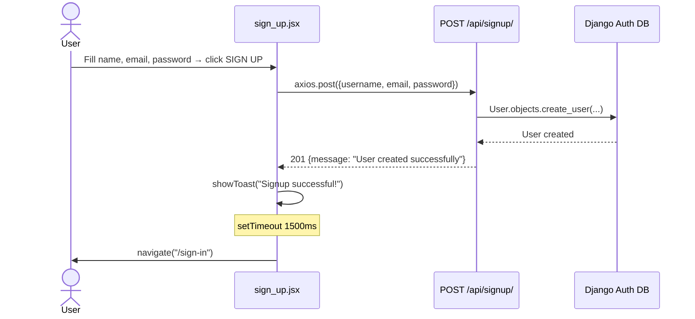

**Error path:** If the username already exists, the API returns `400 {error: "Username already exists"}` and the toast shows the error message.

---

## 2. Sign-In Flow (with Lockout)

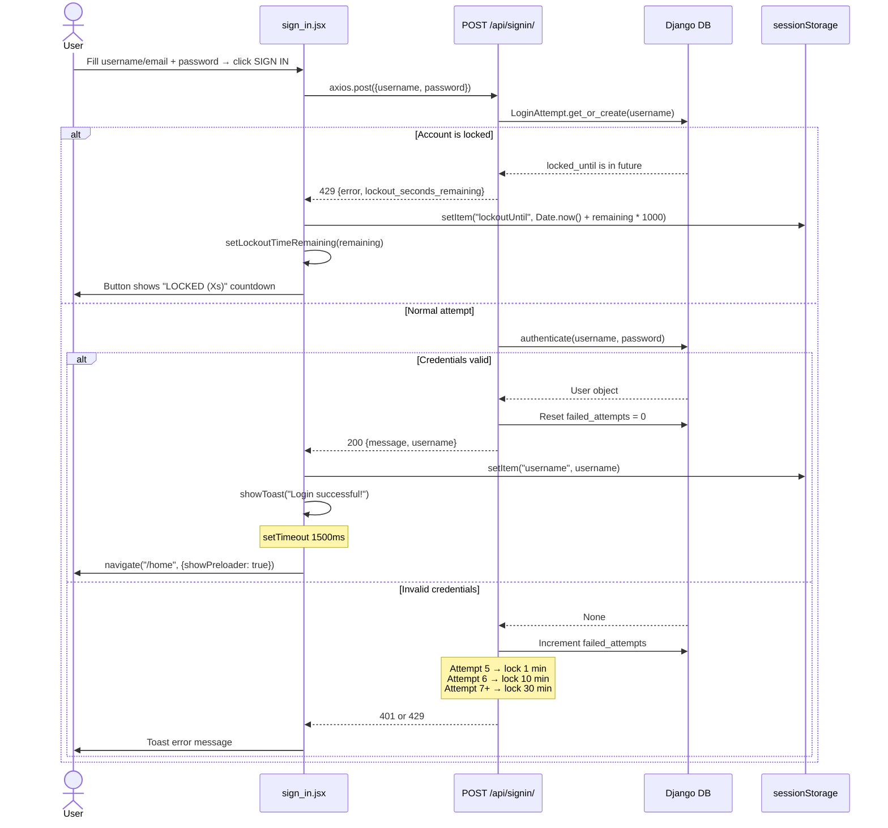

The lockout countdown is persisted in `sessionStorage` as a Unix timestamp (`lockoutUntil`) so it survives page refreshes. A `setInterval` in `useEffect` ticks down the displayed counter every second.

---

## 3. Home Dashboard Load

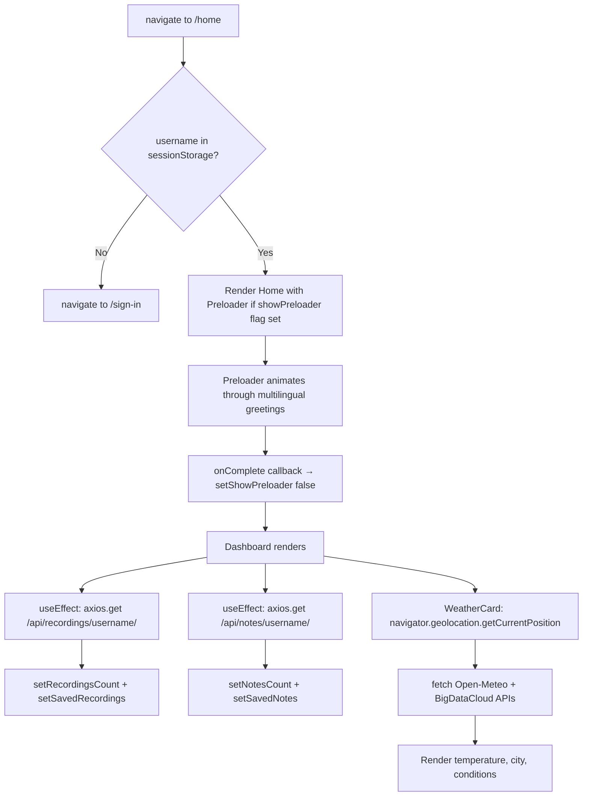

---

## 4. Starting an Instant Meeting

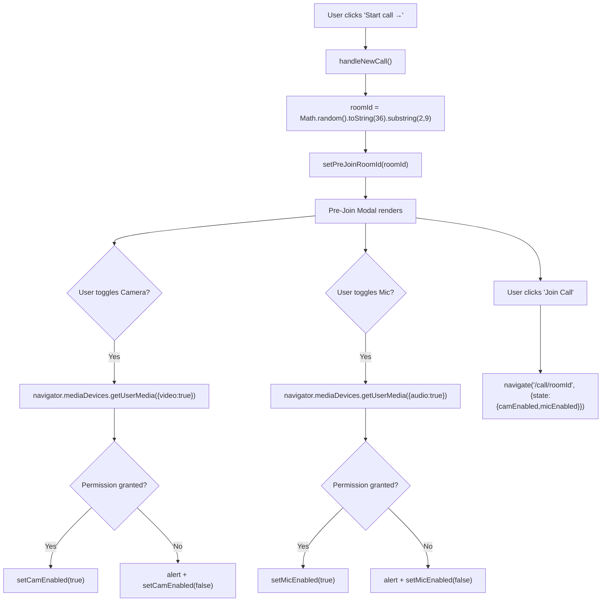

---

## 5. Joining via Room Code

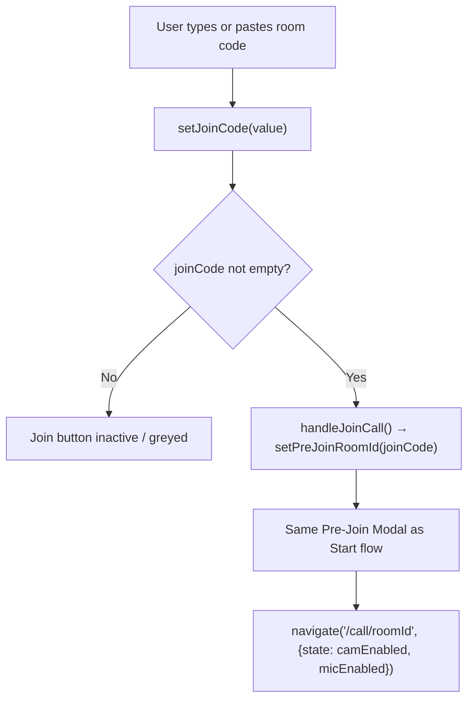

The join input also features a clipboard paste button that calls `navigator.clipboard.readText()`.

---

## 6. WebRTC Connection Establishment (Multi-User)

This sequence shows User B joining a room where User A is already present.

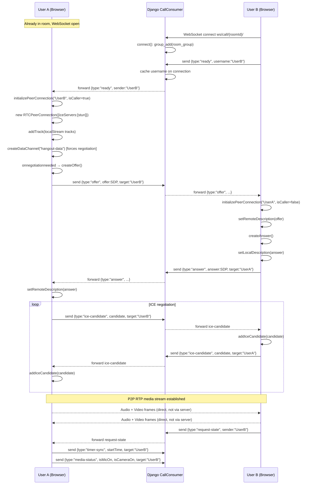

**ICE candidate queuing:** If ICE candidates arrive before `setRemoteDescription` completes, they are pushed to `iceCandidateQueue[sender]` and flushed once the remote description is set.

---

## 7. In-Call Actions

### Mic / Camera Toggle

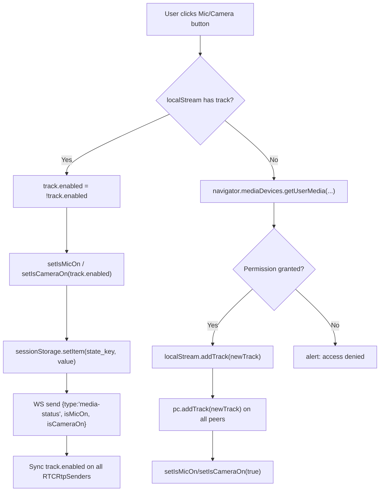

### Chat Message

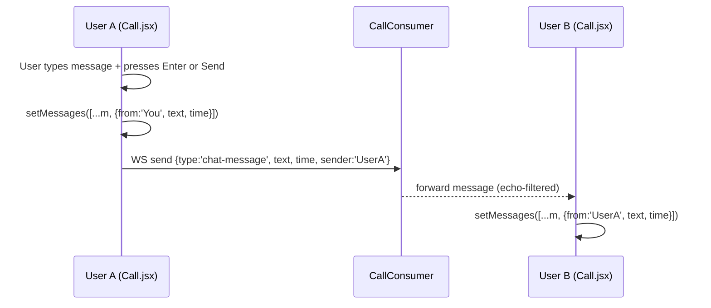

### Notes Save

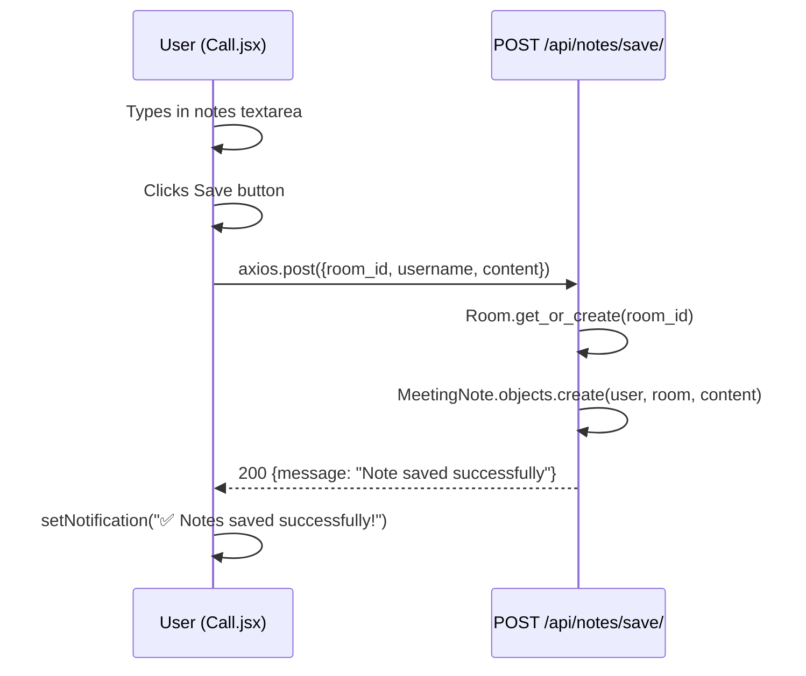

### Video Filters

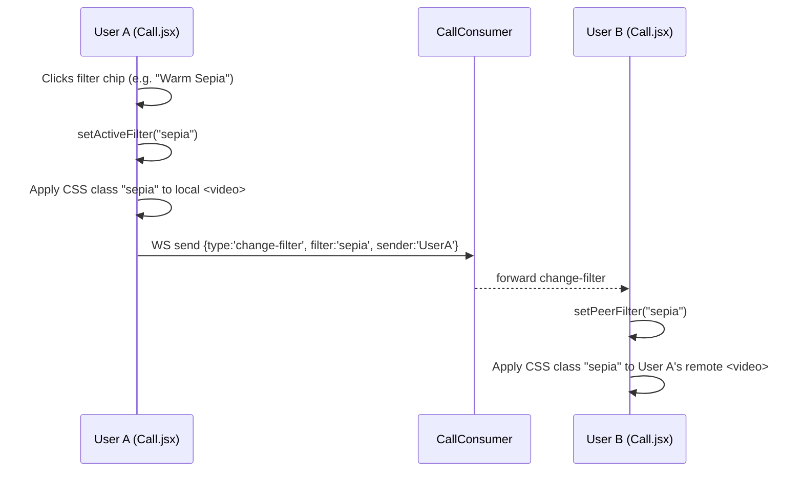

---

## 8. Meeting Recording

```mermaid
sequenceDiagram
    participant User as User (Call.jsx)
    participant Recorder as MediaRecorder API
    participant Canvas as Offscreen Canvas
    participant API as POST /api/recordings/upload/

    User->>User: Clicks Record button (isRecording = false)
    User->>Canvas: createElement('canvas') 1280×720
    User->>Canvas: requestAnimationFrame(drawFrame) loop starts
    Note over Canvas: drawFrame() reads all .stage-video,<br/>.sidebar-video, or .grid-video elements<br/>and paints them to the canvas
    User->>Recorder: canvas.captureStream(30fps) + audio tracks
    User->>Recorder: new MediaRecorder(combinedStream, {mimeType: 'video/webm;codecs=vp9,opus'})
    Recorder->>Recorder: start(1000ms timeslice)
    Recorder->>User: ondataavailable → push to recordedChunks[]
    User->>User: setIsRecording(true)

    User->>User: Clicks Record button again (isRecording = true)
    User->>Recorder: stop()
    Recorder->>User: onstop fires
    User->>Canvas: cancelAnimationFrame() — stop drawing loop
    User->>User: new Blob(recordedChunks, {type:'video/webm'})
    User->>API: axios.post(FormData{video_file, room_id, username})
    API->>API: User.objects.get(username)
    API->>API: Room.get_or_create(room_id)
    API->>API: MeetingRecording.objects.create(user, room, video_file)
    API-->>User: 200 {message: "Upload successful", id}
    User->>User: setNotification("✅ Recording saved!")
```

---

## 9. Screen Sharing

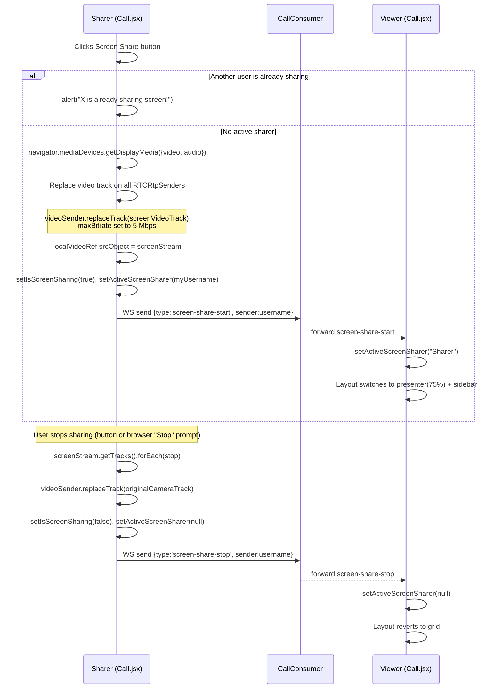

---

## 10. Leaving a Call

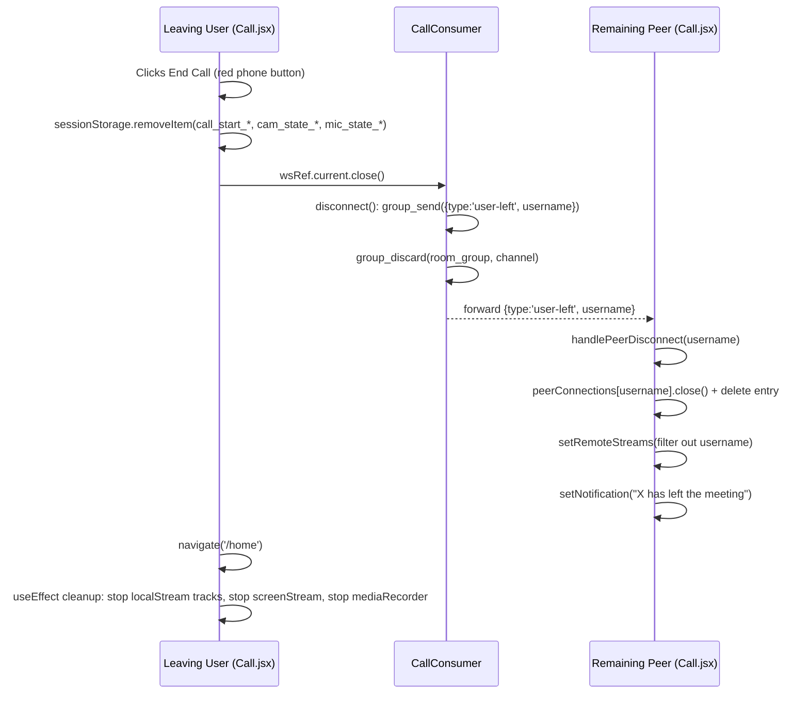

---

## 11. Recording & Notes Management on Dashboard

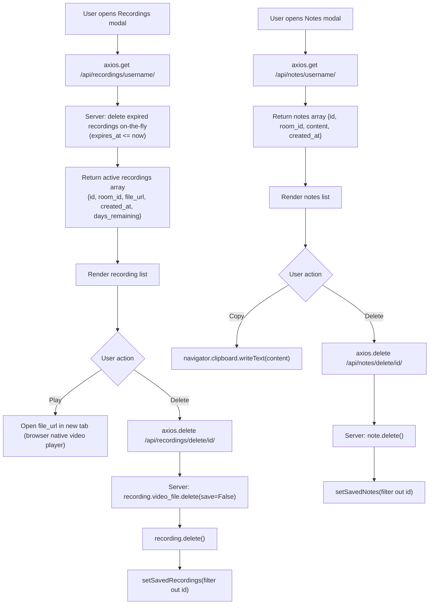
