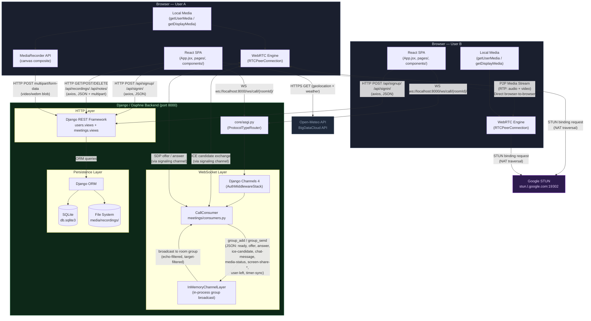

# Architecture

[← Back to README](../README.md)

This document describes the overall system architecture of Hangout, covering how each layer connects, what protocol each connection uses, and where state lives.

---

## System Architecture Diagram

---

## Connection Reference

| Connection | Protocol | Direction | Payload |
|---|---|---|---|
| React → Django REST | HTTP/1.1 (axios) | Request/Response | JSON; multipart/form-data for recording uploads |
| React → Django WebSocket | WebSocket (`ws://`) | Bidirectional | JSON signal messages (see table below) |
| Django → Django (intra-server) | `InMemoryChannelLayer` | Broadcast within process | Python dicts via `group_send` |
| Browser A ↔ Browser B | WebRTC RTP/DTLS | Peer-to-peer | Audio + video media frames; SRTP encrypted |
| Browser → STUN | UDP (STUN protocol) | Request/Response | Binding request for public IP/port discovery |
| `WeatherCard` → External APIs | HTTPS (fetch) | Request/Response | JSON weather data |

### WebSocket Signal Message Types

Every message flowing through the signaling server (`CallConsumer`) is a JSON object with at minimum a `type` and `sender` field. The consumer echo-filters (drops messages back to the sender) and optionally target-filters (drops messages not addressed to `target`).

| `type` | Direction | Purpose |
|---|---|---|
| `ready` | Client → Server → Peers | Announces a new participant; triggers `initializePeerConnection` as caller |
| `request-state` | Client → Server → Peers | Asks existing participants to resend their current state (screen share status, timer, media status) |
| `offer` | Client → Server → Target | SDP offer from the calling peer |
| `answer` | Client → Server → Target | SDP answer from the receiving peer |
| `ice-candidate` | Client → Server → Target | ICE candidate for NAT traversal |
| `media-status` | Client → Server → Peers | Broadcast current `isMicOn` / `isCameraOn` boolean state |
| `screen-share-start` | Client → Server → Peers | Notifies peers that this user started screen sharing |
| `screen-share-stop` | Client → Server → Peers | Notifies peers that screen sharing has stopped |
| `timer-sync` | Client → Server → Target | Synchronises the call start timestamp across joining peers |
| `chat-message` | Client → Server → Peers | In-call chat text message |
| `change-filter` | Client → Server → Peers | Broadcasts the sender's selected CSS video filter |
| `music-status` | Client → Server → Peers | Notifies peers that music sharing started/stopped |
| `user-left` | Server → Peers | Sent by `CallConsumer.disconnect` when a WebSocket closes |

---

## Key Design Decisions

### Full Mesh Topology
Each client maintains a direct `RTCPeerConnection` to every other participant. When User A joins and receives a `ready` signal from User B, A calls `initializePeerConnection(B, isCaller=true)` and creates an offer. As more users join, every new joiner creates connections to all existing participants. This is O(n²) connections but is appropriate for small meeting rooms and avoids a media server.

### Signaling Server as Pure Relay
`CallConsumer` does not inspect or interpret the SDP/ICE payloads. It only routes, echo-filters, and target-filters messages. This keeps the backend stateless with respect to WebRTC negotiation.

### ICE Candidate Queuing
Because ICE candidates can arrive before `setRemoteDescription` completes, `Call.jsx` maintains an `iceCandidateQueue` keyed by sender username. Queued candidates are flushed once the remote description is set.

### Canvas-Based Recording
Instead of recording individual streams, `Call.jsx` creates an offscreen `<canvas>`, draws all video tiles to it at 30 fps using `requestAnimationFrame`, and records the canvas stream with `MediaRecorder`. This produces a single composite video file that matches the layout the user sees.

### InMemoryChannelLayer Limitation
The current channel layer does not support multi-process or multi-server deployments. If Daphne is run with multiple workers, users on different workers will not receive each other's signals. For production, replace with `channels_redis.core.RedisChannelLayer`.
