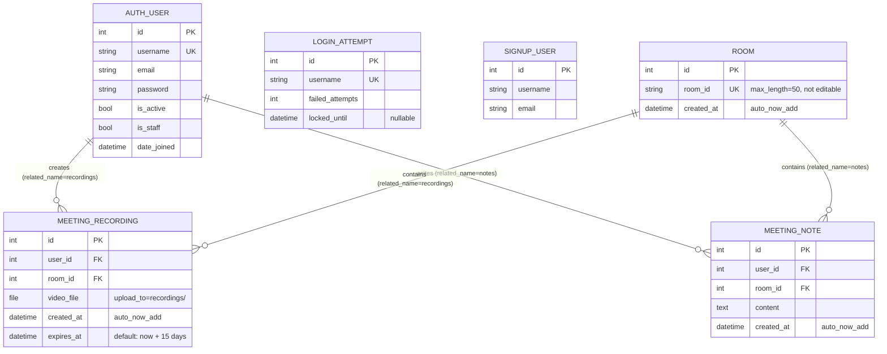

# Database Schema

[← Back to README](../README.md)

This document describes every model in the Django backend. All schema information is derived directly from `users/models.py` and `meetings/models.py`. The project uses SQLite (via Django's default ORM) and Django's built-in `auth.User` model.

---

## Entity-Relationship Diagram

---

## Model Reference

### `AUTH_USER` (Django built-in)

Django's built-in `django.contrib.auth.models.User`. Used by `meetings/models.py` and `meetings/views.py` as the FK target for all per-user data.

| Field | Type | Notes |
|---|---|---|
| `id` | AutoField | Primary key |
| `username` | CharField(150) | Unique; used as the application-level user identifier |
| `email` | EmailField | Optional; the signin view also accepts email in place of username |
| `password` | CharField | Hashed by Django; write-only in the serializer |
| `is_active`, `is_staff`, etc. | BooleanField | Standard Django auth fields |

---

### `LOGIN_ATTEMPT` (`users/models.py`)

Tracks failed login attempts per username to enforce the progressive lockout policy. One row per username (unique constraint).

| Field | Type | Notes |
|---|---|---|
| `id` | AutoField | Primary key |
| `username` | CharField(100) | **Unique**; not a FK to `AUTH_USER` — deliberately decoupled so attempts can be tracked even for non-existent usernames |
| `failed_attempts` | IntegerField | Default `0`; incremented on each failed sign-in |
| `locked_until` | DateTimeField | `null=True, blank=True`; set to `now + lockout_duration` on threshold crossings |

**Lockout schedule** (implemented in `users/views.py`):

| `failed_attempts` value | Lockout duration |
|---|---|
| 5 | 1 minute |
| 6 | 10 minutes |
| ≥ 7 | 30 minutes |

---

### `SIGNUP_USER` (`users/models.py`)

A separate, minimal model that stores basic user profile data independently of Django's auth system. Currently only registered in the admin panel (`users/admin.py`). It is **not** used by any view for authentication — sign-up via `users/views.py` creates a `django.contrib.auth.User` directly.

> **Note:** The relationship between `SIGNUP_USER` and `AUTH_USER` is ambiguous from source code alone — both are created independently on sign-up. `SIGNUP_USER` may be a legacy or supplementary model. Needs confirmation.

| Field | Type | Notes |
|---|---|---|
| `id` | AutoField | Primary key |
| `username` | CharField(100) | Not unique |
| `email` | EmailField | — |

---

### `ROOM` (`meetings/models.py`)

Represents a meeting room. Created on demand — the backend uses `get_or_create(room_id=...)` so rows are lazily created the first time a recording or note references a given room code.

| Field | Type | Notes |
|---|---|---|
| `id` | AutoField | Primary key |
| `room_id` | CharField(50) | **Unique**, `editable=False`; holds the short alphanumeric code generated on the frontend (`Math.random().toString(36).substring(2, 9)`) or entered by the user |
| `created_at` | DateTimeField | `auto_now_add=True` |

---

### `MEETING_RECORDING` (`meetings/models.py`)

Stores a reference to an uploaded video recording file for a specific user and room.

| Field | Type | Notes |
|---|---|---|
| `id` | AutoField | Primary key |
| `user` | ForeignKey → `AUTH_USER` | `on_delete=CASCADE`; `related_name="recordings"` |
| `room` | ForeignKey → `ROOM` | `on_delete=CASCADE`; `related_name="recordings"` |
| `video_file` | FileField | `upload_to="recordings/"`; stored under `MEDIA_ROOT/recordings/` |
| `created_at` | DateTimeField | `auto_now_add=True` |
| `expires_at` | DateTimeField | Default: `timezone.now() + timedelta(days=15)` via `fifteen_days_from_now()` |

**Expiry behaviour:** On every `GET /api/recordings/{username}/` call, the view queries `expires_at__lte=timezone.now()` and deletes both the database row and the physical file (`video_file.delete(save=False)`).

**Instance method:** `is_expired()` → `bool` — returns `True` if `timezone.now() >= self.expires_at`.

---

### `MEETING_NOTE` (`meetings/models.py`)

Stores free-text notes saved by a user during a meeting.

| Field | Type | Notes |
|---|---|---|
| `id` | AutoField | Primary key |
| `user` | ForeignKey → `AUTH_USER` | `on_delete=CASCADE`; `related_name="notes"` |
| `room` | ForeignKey → `ROOM` | `on_delete=CASCADE`; `related_name="notes"` |
| `content` | TextField | The raw note text; no length limit |
| `created_at` | DateTimeField | `auto_now_add=True` |

---

## REST API Endpoints

The following HTTP endpoints are the interface between the frontend and the database layer.

### Auth (`users/urls.py` → prefixed `/api/`)

| Method | URL | Handler | Description |
|---|---|---|---|
| `POST` | `/api/signup/` | `users.views.signup` | Create a new `AUTH_USER` |
| `POST` | `/api/signin/` | `users.views.signin` | Authenticate; returns `{username}` on success |

### Recordings (`core/urls.py`)

| Method | URL | Handler | Description |
|---|---|---|---|
| `POST` | `/api/recordings/upload/` | `meetings.views.upload_recording` | Upload a video file; creates `ROOM` if needed |
| `GET` | `/api/recordings/<username>/` | `meetings.views.get_user_recordings` | List recordings; purges expired ones first |
| `DELETE` | `/api/recordings/delete/<id>/` | `meetings.views.delete_recording` | Delete a recording and its file |

### Notes (`core/urls.py`)

| Method | URL | Handler | Description |
|---|---|---|---|
| `POST` | `/api/notes/save/` | `meetings.views.save_note` | Save a note; creates `ROOM` if needed |
| `GET` | `/api/notes/<username>/` | `meetings.views.get_user_notes` | List all notes for a user |
| `DELETE` | `/api/notes/delete/<id>/` | `meetings.views.delete_note` | Delete a note |

### WebSocket (`meetings/routing.py`)

| Protocol | Pattern | Handler |
|---|---|---|
| WebSocket | `ws/call/<room_id>/` | `meetings.consumers.CallConsumer` |
